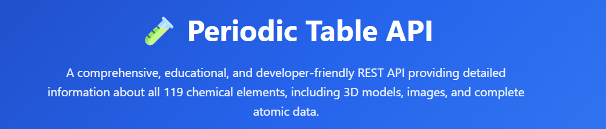

# 🧪 Periodic Table API

---


> **A comprehensive, educational, and developer-friendly REST API providing detailed information about all 119 chemical elements, complete with 3D models, images, and extensive atomic data.**

---

## 📋 Table of Contents

- [Overview](#-overview)
- [Features](#-features)
- [Why Use This API?](#-why-use-this-api)
- [Quick Start](#-quick-start)
- [API Endpoints](#-api-endpoints)
- [Data Structure](#-data-structure)
- [Use Cases](#-use-cases)
- [Integration Examples](#-integration-examples)
- [Technical Specifications](#-technical-specifications)
- [Contributing](#-contributing)
- [License](#-license)
- [Acknowledgments](#-acknowledgments)

---

## 🌟 Overview

The **Periodic Table API** is a robust, production-ready RESTful web service designed to bridge the gap between chemistry education and modern software development. Built on top of a meticulously curated JSON dataset containing comprehensive information about all 119 chemical elements (including synthetic elements up to Ununennium), this API serves as a powerful educational tool and development resource.

### What Makes This API Special?

Unlike simple periodic table datasets, this API provides:

- **Complete Element Coverage**: All 119 elements from Hydrogen (1) to Ununennium (119)
- **Rich Media Assets**: 2D images, 3D GLB models, spectral images, and real element photographs
- **Comprehensive Data**: 30+ properties per element including atomic structure, physical properties, and historical information
- **Educational Focus**: Designed with both students and educators in mind
- **Developer-Friendly**: Clean JSON responses, RESTful architecture, and no authentication required
- **Cross-Platform Compatible**: Works with any programming language or framework that supports HTTP requests

### The Story Behind This Project

This API was created to address a fundamental challenge in chemistry education: making complex atomic data accessible, interactive, and engaging. Traditional textbooks present static information, while this API enables developers to create dynamic, interactive applications that bring chemistry to life. Whether you're building a mobile app for students, a data visualization dashboard, or an augmented reality chemistry lab, this API provides the foundation you need.

---

## ✨ Features

### 📊 Comprehensive Data Coverage

- **119 Elements**: Complete coverage from Hydrogen to Ununennium
- **30+ Properties Per Element**: Including atomic mass, electron configuration, ionization energies, electronegativity, density, melting/boiling points, and more
- **Historical Context**: Discoverers, discovery dates, and naming information
- **Phase Information**: Solid, liquid, gas, or unknown states at standard conditions
- **Periodic Table Positioning**: Period, group, and block classifications

### 🎨 Rich Media Assets

- **Real Element Photographs**: High-quality images of actual elements
- **2D Bohr Models**: Visual representations of electron shell configurations
- **3D GLB Models**: Interactive 3D models compatible with WebGL, AR, and VR applications
- **Spectral Images**: Emission spectrum photographs for applicable elements
- **Attribution Information**: Proper credit and licensing for all images

### 🔍 Flexible Query System

- **By Element**: Search by name, symbol, or atomic number
- **By Period**: Retrieve all elements in a specific row
- **By Group**: Get all elements in a vertical column
- **By Category**: Filter by element type (metals, nonmetals, noble gases, etc.)
- **Complete Dataset**: Retrieve all 119 elements in a single call

### 🚀 Developer-Friendly Design

- **RESTful Architecture**: Standard HTTP GET requests
- **JSON Format**: Clean, parseable responses
- **No Authentication**: Completely open and free to use
- **CORS Support**: Cross-origin requests enabled
- **Proper HTTP Status Codes**: 200 (success), 404 (not found), 400 (bad request)
- **Consistent Data Structure**: Predictable response format across all endpoints

### 📱 Cross-Platform Compatibility

Works seamlessly with:
- JavaScript/TypeScript (React, Vue, Angular, Node.js)
- Python (requests, aiohttp, Django, Flask)
- Java (HttpClient, Spring Boot)
- Swift (URLSession, Alamofire)
- Kotlin (Retrofit, Ktor)
- Ruby (Net::HTTP, HTTParty)
- Go (net/http)
- PHP (cURL, Guzzle)
- And any language with HTTP support!

---

## 💡 Why Use This API?

### For Educators

**Transform Chemistry Education**: Move beyond static textbooks and create interactive learning experiences. Build quiz applications, virtual laboratories, and periodic table explorers that engage students with real data and visual models.

**Curriculum Integration**: Align with chemistry curricula worldwide. The API includes data on electron configurations, ionization energies, electronegativity, and other concepts central to chemistry education.

**Assessment Tools**: Create automated quiz systems, element identification games, and data analysis exercises that leverage real scientific data.

### For Students

**Interactive Learning**: Access the same data used in professional research and education, but in a format designed for exploration and experimentation.

**Project Development**: Build chemistry-related projects for coursework, science fairs, or personal learning. The API provides everything needed for web apps, mobile applications, or data science projects.

**Research Foundation**: Use comprehensive element data for chemistry research projects, computational analysis, or molecular modeling foundations.

### For Developers

**Rich Dataset**: Access 119 elements × 30+ properties = 3,500+ data points in a single, well-structured API.

**Rapid Prototyping**: No authentication, no rate limits, no setup complexity. Start building immediately.

**Media-Rich Applications**: Leverage 3D models, images, and spectral data to create visually stunning applications without hunting for assets.

**Documentation**: Complete API documentation with examples in multiple programming languages.

### For Researchers

**Standardized Data**: Consistent, well-formatted element data suitable for computational chemistry, data science, and scientific computing.

**Programmatic Access**: Integrate periodic table data into research workflows, automated analysis pipelines, or scientific simulations.

**Citation Ready**: Includes source URLs and attribution information for academic use.

---

## 🚀 Quick Start

### Installation

No installation required! This is a RESTful API accessible via HTTP requests.

### Making Your First Request

**Using cURL:**
```bash
curl "https://coddoc.xyz/ptapi/api.php?element=Oxygen"
```

**Using JavaScript (Fetch API):**
```javascript
fetch('https://coddoc.xyz/ptapi/api.php?element=Oxygen')
  .then(response => response.json())
  .then(data => console.log(data));
```

**Using Python (requests):**
```python
import requests

response = requests.get('https://coddoc.xyz/ptapi/api.php?element=Oxygen')
data = response.json()
print(data)
```

### Response Example

```json
{
  "name": "Oxygen",
  "symbol": "O",
  "number": 8,
  "atomic_mass": 15.999,
  "category": "diatomic nonmetal",
  "phase": "Gas",
  "period": 2,
  "group": 16,
  "electron_configuration": "1s2 2s2 2p4",
  "electronegativity_pauling": 3.44,
  "image": {
    "url": "https://upload.wikimedia.org/...",
    "title": "Liquid Oxygen in a Beaker",
    "attribution": "..."
  },
  "bohr_model_3d": "https://storage.googleapis.com/.../element_008_oxygen.glb"
}
```

---

## 📡 API Endpoints

### Base URL
```
https://coddoc.xyz/ptapi/api.php
```

### 1. Get All Elements

Retrieve the complete periodic table with all 119 elements.

**Endpoint:**
```
GET https://coddoc.xyz/ptapi/api.php?all=true
```

**Example Request:**
```bash
curl "https://coddoc.xyz/ptapi/api.php?all=true"
```

**Response Format:**
```json
{
  "count": 119,
  "elements": [
    {
      "name": "Hydrogen",
      "symbol": "H",
      "number": 1,
      ...
    },
    {
      "name": "Helium",
      "symbol": "He",
      "number": 2,
      ...
    }
  ]
}
```

**Use Cases:**
- Display complete periodic table
- Offline applications
- Data exports
- Comprehensive analysis
- Database seeding

---

### 2. Get Single Element

Retrieve detailed information about a specific element by name, symbol, or atomic number.

**Endpoint:**
```
GET /api.php?element={value}
```

**Parameters:**
| Parameter | Type | Description | Examples |
|-----------|------|-------------|----------|
| `element` | string/integer | Element name, symbol, or atomic number (case-insensitive) | `Oxygen`, `O`, `8` |

**Example Requests:**

By name:
```bash
curl "https://coddoc.xyz/ptapi/api.php?element=Oxygen"
```

By symbol:
```bash
curl "https://coddoc.xyz/ptapi/api.php?element=Fe"
```

By atomic number:
```bash
curl "https://coddoc.xyz/ptapi/api.php?element=79"
```

**JavaScript Example:**
```javascript
async function getElement(identifier) {
  const response = await fetch(`api.php?element=${identifier}`);
  const element = await response.json();
  return element;
}

// Usage
const oxygen = await getElement('Oxygen');
const iron = await getElement('Fe');
const gold = await getElement(79);
```

**Python Example:**
```python
def get_element(identifier):
    url = f"https://coddoc.xyz/ptapi/api.php?element={identifier}"
    response = requests.get(url)
    return response.json()

# Usage
oxygen = get_element('Oxygen')
iron = get_element('Fe')
gold = get_element(79)
```

**Response Structure:**
```json
{
  "name": "Iron",
  "symbol": "Fe",
  "number": 26,
  "atomic_mass": 55.8452,
  "appearance": "lustrous metallic with a grayish tinge",
  "category": "transition metal",
  "phase": "Solid",
  "density": 7.874,
  "melt": 1811,
  "boil": 3134,
  "molar_heat": 25.1,
  "period": 4,
  "group": 8,
  "block": "d",
  "electron_configuration": "1s2 2s2 2p6 3s2 3p6 4s2 3d6",
  "electron_configuration_semantic": "[Ar] 3d6 4s2",
  "electron_affinity": 14.785,
  "electronegativity_pauling": 1.83,
  "ionization_energies": [762.5, 1561.9, 2957, ...],
  "shells": [2, 8, 14, 2],
  "discovered_by": "5000 BC",
  "named_by": null,
  "source": "https://en.wikipedia.org/wiki/Iron",
  "cpk-hex": "e06633",
  "image": {
    "url": "https://images-of-elements.com/iron-2.jpg",
    "title": "Fragments of an iron meteorite",
    "attribution": "Chemical ELements A Virtual Museum, CC BY 3.0"
  },
  "bohr_model_image": "https://storage.googleapis.com/.../element_026_iron_srp_th.png",
  "bohr_model_3d": "https://storage.googleapis.com/.../element_026_iron.glb",
  "spectral_img": "https://en.wikipedia.org/wiki/File:Iron_Spectrum.jpg",
  "summary": "Iron is a chemical element with symbol Fe..."
}
```

---

### 3. Get Elements by Period

Retrieve all elements from a specific period (horizontal row) of the periodic table.

**Endpoint:**
```
GET /api.php?period={number}
```

**Parameters:**
| Parameter | Type | Range | Description |
|-----------|------|-------|-------------|
| `period` | integer | 1-8 | Period number (row in periodic table) |

**Period Overview:**
- **Period 1**: 2 elements (H, He)
- **Period 2**: 8 elements (Li through Ne)
- **Period 3**: 8 elements (Na through Ar)
- **Period 4**: 18 elements (K through Kr)
- **Period 5**: 18 elements (Rb through Xe)
- **Period 6**: 32 elements (Cs through Rn, including lanthanides)
- **Period 7**: 32 elements (Fr through Og, including actinides)
- **Period 8**: 1 element (Uue - hypothetical)

**Example Request:**
```bash
curl "https://coddoc.xyz/ptapi/api.php?period=2"
```

**Response:**
```json
{
  "period": 2,
  "count": 8,
  "elements": [
    { "name": "Lithium", "symbol": "Li", "number": 3, ... },
    { "name": "Beryllium", "symbol": "Be", "number": 4, ... },
    { "name": "Boron", "symbol": "B", "number": 5, ... },
    { "name": "Carbon", "symbol": "C", "number": 6, ... },
    { "name": "Nitrogen", "symbol": "N", "number": 7, ... },
    { "name": "Oxygen", "symbol": "O", "number": 8, ... },
    { "name": "Fluorine", "symbol": "F", "number": 9, ... },
    { "name": "Neon", "symbol": "Ne", "number": 10, ... }
  ]
}
```

**Use Cases:**
- Period-based chemistry lessons
- Analyzing periodic trends across a row
- Building interactive periodic table rows
- Period-specific quizzes

---

### 4. Get Elements by Group

Retrieve all elements from a specific group (vertical column) of the periodic table.

**Endpoint:**
```
GET /api.php?group={number}
```

**Parameters:**
| Parameter | Type | Range | Description |
|-----------|------|-------|-------------|
| `group` | integer | 1-18 | Group number (column in periodic table) |

**Notable Groups:**
- **Group 1**: Alkali metals (H, Li, Na, K, Rb, Cs, Fr)
- **Group 2**: Alkaline earth metals (Be, Mg, Ca, Sr, Ba, Ra)
- **Group 17**: Halogens (F, Cl, Br, I, At, Ts)
- **Group 18**: Noble gases (He, Ne, Ar, Kr, Xe, Rn, Og)
- **Groups 3-12**: Transition metals

**Example Request:**
```bash
curl "https://coddoc.xyz/ptapi/api.php?group=17"
```

**Response:**
```json
{
  "group": 17,
  "count": 6,
  "elements": [
    { "name": "Fluorine", "symbol": "F", "number": 9, ... },
    { "name": "Chlorine", "symbol": "Cl", "number": 17, ... },
    { "name": "Bromine", "symbol": "Br", "number": 35, ... },
    { "name": "Iodine", "symbol": "I", "number": 53, ... },
    { "name": "Astatine", "symbol": "At", "number": 85, ... },
    { "name": "Tennessine", "symbol": "Ts", "number": 117, ... }
  ]
}
```

**Use Cases:**
- Studying element families
- Analyzing periodic trends down a column
- Group-specific chemistry lessons
- Comparing similar elements

---

### 5. Get Elements by Type/Category

Retrieve all elements of a specific chemical category.

**Endpoint:**
```
GET /api.php?type={category}
```

**Parameters:**
| Parameter | Type | Description |
|-----------|------|-------------|
| `type` | string | Element category (case-insensitive) |

**Available Categories:**

| Category | Count | Examples |
|----------|-------|----------|
| `alkali metal` | 6 | Li, Na, K, Rb, Cs, Fr |
| `alkaline earth metal` | 6 | Be, Mg, Ca, Sr, Ba, Ra |
| `transition metal` | 38 | Fe, Cu, Au, Ag, Pt |
| `post-transition metal` | 7 | Al, Ga, In, Sn, Pb, Bi |
| `metalloid` | 7 | B, Si, Ge, As, Sb, Te |
| `diatomic nonmetal` | 5 | H, N, O, F, Cl |
| `polyatomic nonmetal` | 3 | C, P, S, Se |
| `noble gas` | 7 | He, Ne, Ar, Kr, Xe, Rn, Og |
| `lanthanide` | 15 | La, Ce, Nd, Eu, Gd |
| `actinide` | 15 | Ac, Th, U, Pu, Am |

**Example Request:**
```bash
curl "https://coddoc.xyz/ptapi/api.php?type=noble%20gas"
```

**JavaScript Example:**
```javascript
const category = 'noble gas';
const url = `api.php?type=${encodeURIComponent(category)}`;
const response = await fetch(url);
const data = await response.json();
```

**Response:**
```json
{
  "type": "noble gas",
  "count": 7,
  "elements": [
    { "name": "Helium", "symbol": "He", "number": 2, ... },
    { "name": "Neon", "symbol": "Ne", "number": 10, ... },
    { "name": "Argon", "symbol": "Ar", "number": 18, ... },
    { "name": "Krypton", "symbol": "Kr", "number": 36, ... },
    { "name": "Xenon", "symbol": "Xe", "number": 54, ... },
    { "name": "Radon", "symbol": "Rn", "number": 86, ... },
    { "name": "Oganesson", "symbol": "Og", "number": 118, ... }
  ]
}
```

**Use Cases:**
- Category-based filtering
- Teaching element classifications
- Building chemistry games
- Comparative analysis

---

### Error Responses

The API returns appropriate HTTP status codes and error messages:

**404 Not Found** - Element doesn't exist:
```json
{
  "error": "Element not found"
}
```

**400 Bad Request** - Invalid parameters:
```json
{
  "error": "Invalid API request"
}
```

**500 Internal Server Error** - Server issue:
```json
{
  "error": "pt.json not found"
}
```

---

## 📊 Data Structure

Each element contains up to 30+ properties providing comprehensive information:

### Basic Identification
- `name`: Full element name
- `symbol`: Chemical symbol (1-3 letters)
- `number`: Atomic number (1-119)

### Physical Properties
- `atomic_mass`: Atomic weight in unified atomic mass units
- `density`: Density in g/cm³
- `melt`: Melting point in Kelvin
- `boil`: Boiling point in Kelvin
- `molar_heat`: Molar heat capacity
- `phase`: Physical state at standard conditions
- `appearance`: Visual description

### Atomic Structure
- `electron_configuration`: Full electron configuration
- `electron_configuration_semantic`: Shorthand notation
- `shells`: Electrons per shell array
- `block`: s, p, d, or f block

### Chemical Properties
- `electron_affinity`: Electron affinity in kJ/mol
- `electronegativity_pauling`: Pauling electronegativity
- `ionization_energies`: Array of ionization energies

### Classification
- `category`: Element type/family
- `period`: Period number (1-8)
- `group`: Group number (1-18)

### Historical Information
- `discovered_by`: Person/civilization who discovered
- `named_by`: Person who named the element
- `source`: Wikipedia reference URL

### Visual Assets
- `image`: Object with url, title, attribution
- `bohr_model_image`: 2D Bohr model URL
- `bohr_model_3d`: 3D GLB model URL
- `spectral_img`: Emission spectrum URL
- `cpk-hex`: CPK coloring hex code

### Additional Data
- `summary`: Comprehensive description
- `xpos`, `ypos`: Standard periodic table position
- `wxpos`, `wypos`: Wide periodic table position

---

## 🎯 Use Cases

### 1. Educational Web Applications

Build interactive periodic table explorers:
```javascript
// Periodic table grid
const periods = [1, 2, 3, 4, 5, 6, 7];
const grid = await Promise.all(
  periods.map(p => fetch(`api.php?period=${p}`).then(r => r.json()))
);

// Display elements
grid.forEach(period => {
  period.elements.forEach(element => {
    createElementCard(element);
  });
});
```

### 2. Mobile Learning Apps

Create element flashcards:
```swift
// Swift example
struct Element: Codable {
    let name: String
    let symbol: String
    let number: Int
    let summary: String
}

func fetchElement(_ identifier: String) async throws -> Element {
    let url = URL(string: "api.php?element=\(identifier)")!
    let (data, _) = try await URLSession.shared.data(from: url)
    return try JSONDecoder().decode(Element.self, from: data)
}
```

### 3. Data Visualization

Create periodic trends graphs:
```python
import requests
import matplotlib.pyplot as plt

# Get all elements
response = requests.get('api.php?all=true')
elements = response.json()['elements']

# Extract data
numbers = [e['number'] for e in elements]
electronegativities = [e.get('electronegativity_pauling', 0) for e in elements]

# Plot
plt.scatter(numbers, electronegativities)
plt.xlabel('Atomic Number')
plt.ylabel('Electronegativity')
plt.title('Periodic Trend: Electronegativity')
plt.show()
```

### 4. AR/VR Applications

Load 3D models in Unity/WebGL:
```javascript
// Three.js example
import { GLTFLoader } from 'three/examples/jsm/loaders/GLTFLoader';

async function load3DModel(elementSymbol) {
  const response = await fetch(`api.php?element=${elementSymbol}`);
  const element = await response.json();
  
  const loader = new GLTFLoader();
  loader.load(element.bohr_model_3d, (gltf) => {
    scene.add(gltf.scene);
  });
}
```

### 5. Quiz Applications

Generate chemistry quizzes:
```javascript
async function generateQuiz(category) {
  const response = await fetch(`api.php?type=${category}`);
  const data = await response.json();
  
  // Random element
  const element = data.elements[Math.floor(Math.random() * data.elements.length)];
  
  return {
    question: `What is the symbol for ${element.name}?`,
    answer: element.symbol,
    options: generateOptions(element.symbol, data.elements)
  };
}
```

---

## 🔧 Integration Examples

### React Component

```jsx
import React, { useState, useEffect } from 'react';

function ElementCard({ elementId }) {
  const [element, setElement] = useState(null);
  const [loading, setLoading] = useState(true);

  useEffect(() => {
    fetch(`api.php?element=${elementId}`)
      .then(res => res.json())
      .then(data => {
        setElement(data);
        setLoading(false);
      });
  }, [elementId]);

  if (loading) return <div>Loading...</div>;

  return (
    <div className="element-card">
      <h2>{element.name} ({element.symbol})</h2>
      <p>Atomic Number: {element.number}</p>
      <p>Category: {element.category}</p>
      {element.image && }
      <p>{element.summary}</p>
    </div>
  );
}
```

### Vue.js Component

```vue
<template>
  <div v-if="element" class="element">
    <h2>{{ element.name }} ({{ element.symbol }})</h2>
    <p>Atomic Number: {{ element.number }}</p>
    
  </div>
</template>

<script>
export default {
  data() {
    return { element: null };
  },
  async mounted() {
    const response = await fetch('api.php?element=Gold');
    this.element = await response.json();
  }
};
</script>
```

### Python Flask Application

```python
from flask import Flask, render_template
import requests

app = Flask(__name__)
API_BASE = 'https://coddoc.xyz/ptapi/api.php'

@app.route('/element/<identifier>')
def element_page(identifier):
    response = requests.get(f'{API_BASE}?element={identifier}')
    element = response.json()
    return render_template('element.html', element=element)

@app.route('/category/<category>')
def category_page(category):
    response = requests.get(f'{API_BASE}?type={category}')
    data = response.json()
    return render_template('category.html', elements=data['elements'])
```

---

## 🛠 Technical Specifications

### Technology Stack
- **Backend**: PHP 7.4+
- **Data Format**: JSON
- **HTTP Methods**: GET
- **Response Format**: application/json
- **Character Encoding**: UTF-8

### Performance
- **Response Time**: < 100ms for single element
- **Response Time**: < 500ms for all elements
- **File Size**: ~2.5MB for complete dataset
- **Caching**: Recommended for production

### Browser Compatibility
- Chrome 90+
- Firefox 88+
- Safari 14+
- Edge 90+
- Mobile browsers (iOS Safari, Chrome Mobile)

### Requirements
- PHP 7.4 or higher
- JSON extension enabled
- Web server (Apache, Nginx)
- pt.json data file

---

## 🤝 Contributing

We welcome contributions! Here's how you can help:

### Reporting Issues
- Check existing issues first
- Provide detailed description
- Include API endpoint and parameters
- Share expected vs actual results

### Suggesting Features
- Open an issue with [Feature Request] tag
- Describe the use case
- Explain expected behavior

### Pull Requests
1. Fork the repository
2. Create feature branch
3. Make your changes
4. Test thoroughly
5. Submit pull request

---

## 📄 License

This project is licensed under the MIT License.

```
MIT License

Copyright (c) 2024 Debapriya Mukherjee

Permission is hereby granted, free of charge, to any person obtaining a copy
of this software and associated documentation files (the "Software"), to deal
in the Software without restriction, including without limitation the rights
to use, copy, modify, merge, publish, distribute, sublicense, and/or sell
copies of the Software, and to permit persons to whom the Software is
furnished to do so, subject to the following conditions:

The above copyright notice and this permission notice shall be included in all
copies or substantial portions of the Software.

THE SOFTWARE IS PROVIDED "AS IS", WITHOUT WARRANTY OF ANY KIND, EXPRESS OR
IMPLIED, INCLUDING BUT NOT LIMITED TO THE WARRANTIES OF MERCHANTABILITY,
FITNESS FOR A PARTICULAR PURPOSE AND NONINFRINGEMENT. IN NO EVENT SHALL THE
AUTHORS OR COPYRIGHT HOLDERS BE LIABLE FOR ANY CLAIM, DAMAGES OR OTHER
LIABILITY, WHETHER IN AN ACTION OF CONTRACT, TORT OR OTHERWISE, ARISING FROM,
OUT OF OR IN CONNECTION WITH THE SOFTWARE OR THE USE OR OTHER DEALINGS IN THE
SOFTWARE.
```

---

## 🙏 Acknowledgments

### Data Sources
- Element data compiled from Wikipedia
- 3D Models: Google AR/Search (Model Viewer)
- Images: Wikimedia Commons contributors
- Chemical data: Various academic sources

### Special Thanks
- Chemistry educators worldwide
- Open source community
- Contributors and testers
- Students and developers using this API

### Image Attribution
All element images include proper attribution as per Creative Commons licenses. See individual element responses for specific credits.

---

## 📞 Support & Contact

- **Documentation**: See this README and inline code comments
- **Issues**: GitHub Issues page
- **Questions**: Open a discussion on GitHub
- **Updates**: Watch the repository for updates

---

## 🔄 Version History

### v1.0.0 (Current)
- ✅ Complete 119-element dataset
- ✅ All API endpoints functional
- ✅ 3D model support
- ✅ Comprehensive documentation
- ✅ RESTful architecture

---

## 🎓 Educational Resources

### Learning Chemistry with This API
1. **Periodic Trends**: Compare electronegativity, atomic radius across periods/groups
2. **Electron Configuration**: Study shell structure and quantum mechanics
3. **Element Classification**: Understand metals, nonmetals, metalloids
4. **Historical Context**: Learn discovery timeline and naming conventions

### Suggested Projects
- Interactive periodic table
- Element quiz game
- 3D molecular visualization
- Chemistry calculator
- Periodic trends analyzer
- AR element explorer

---

## 🚀 Future Roadmap

- [ ] GraphQL endpoint
- [ ] WebSocket support for real-time updates
- [ ] Additional element properties (crystal structure, isotopes)
- [ ] Compound data (molecules, reactions)
- [ ] Multi-language support
- [ ] API rate limiting options
- [ ] Authentication for premium features

---

<div align="center">

**Built with ❤️ for chemistry education and software development**

Created by **Debapriya Mukherjee**


⭐ Star this project if you find it useful!

</div>
